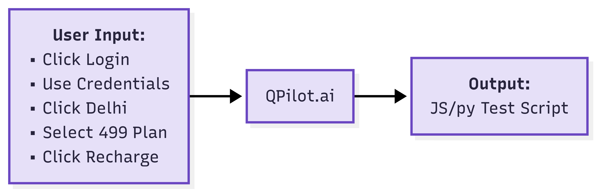

### AI Agent for End-to-End Testing to Deliver Flawless Digital Experiences

---

What if Ai Agent could write tests for your codebase? End-to-end? and for mobile too? and it auto heals / auto-adjusts when your codebase changes?

We share nuggets we learnt while building an AI Agent to solve one of the most persistent challenges in software development: making UI test automation accessible, reliable, and scalable across platforms and devices.

{/* truncate */}

### The Problem

Test automation has historically been:

- **Too technical**: requiring code expertise
- **Time-consuming**: for authoring and maintaining scripts
- **Platform-limited**: with fragmented support for web vs. mobile
- **Fragile**: breaking with minor UI changes or incomplete user flows

Existing tools were not built for the demands of today's fast-moving, multi-platform development cycles. They struggled particularly with hybrid apps, dynamic interfaces, and gesture-driven experiences.

---

### The Solution: AI Agent

AI agent designed from the ground up as an intelligent, prompt-driven automation system with key capabilities:

### Natural Language to Automation Code

Users describe test scenarios in plain English. It translates them into precise, executable test scripts—including test data, validations, and edge cases.

### Web & Mobile App Testing

Supports both web (Selenium, Playwright) and mobile (Appium) frameworks, making it one of the few solutions that bridges the gap between platforms seamlessly.

### Multi-Language Support

Generates scripts in Java, Python, JavaScript, and other frameworks—tailored to the team's existing tech stack.

### Smart Debugging

Executes each script line in real-time as it's generated, identifying and correcting issues on the fly.

### Cross-Device Execution

Run tests instantly across 5,000+ combinations of real browsers and devices (when connected to cloud infrastructure).

### Self-Healing Automation

Detects and updates selectors and steps automatically as the application evolves, eliminating the need for manual maintenance.

---

### Core Technical Challenges Solved

### UI Automation for Flutter Web and Hybrid Mobile Apps

Most automation tools break down on platforms like Flutter Web, where the UI is rendered inside a `<canvas>` instead of standard HTML elements, and on hybrid apps without accessible DOM trees.

**Our agent solved this by enabling interaction with non-standard UIs using a combination of visual, contextual, and heuristic techniques**—delivering true end-to-end automation where no other solution worked.

---

### Accurate and Reusable Script Generation

Running LLMs for every test execution is expensive and error-prone.

This AI Agent implemented a **novel templating and generation system** that decouples script generation from execution. This allowed:

- Complete and correct scripts on the first pass
- Reusability across test runs and frameworks
- Fast, low-cost, scalable test creation

---

### Complex Gestures and UI Behaviors

Simulating gestures like pinch, zoom, drag-and-drop, or multi-touch is notoriously hard—especially in custom components.

This agent provided **fine-grained control** over gesture simulation, going beyond the abstractions of typical libraries, enabling accurate testing of sliders, carousels, maps, and more.

---

### Mapping Natural Language to UI Actions Reliably

Natural language like “Click the Pay button” can be ambiguous—especially in large, dynamic UIs.

**Being very smart, it combined multiple modalities—DOM structure, visual layout, and semantic cues**—to reliably identify elements even when conventional locators failed. This enabled it to handle vague prompts and incomplete context with high precision.

---

### Stability in Dynamic & Incomplete User Flows

In real-world apps, pop-ups appear unexpectedly, elements load asynchronously, and flows can be interrupted.

It was was designed to **recover intelligently** from such cases using retry logic, timeout strategies, and partial flow handling. This brought production-grade resilience to end-to-end test execution.

---

### Scalable Evaluation & Debugging Infrastructure

A major limitation of LLM-based systems is the lack of robust evaluation.

AI Agent addressed this by building a **custom evaluation framework** that:

- Validated script correctness at each step
- Enabled partial re-execution of scripts
- Provided fine-grained feedback for model improvement
    
This drastically accelerated iteration speed and allowed for deeper validation of system accuracy.
    

---

### Conclusion

AI Agent redefines what's possible in test automation. By combining the reasoning power of LLMs with robust engineering for execution, gesture control, and UI resilience, it makes test automation accessible to non-engineers while retaining power for experts.

From tackling the hardest UI platforms like Flutter Web to enabling precise, reusable test generation and execution at scale, our custom AI agent is a leap forward in the world of quality engineering.

It's not just a tool—it's a full-stack AI agent that understands, adapts, and evolves with your application.