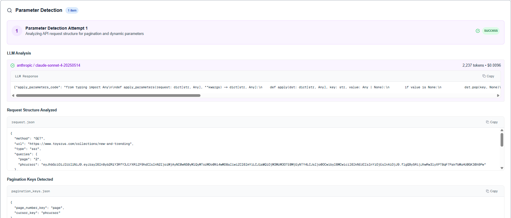
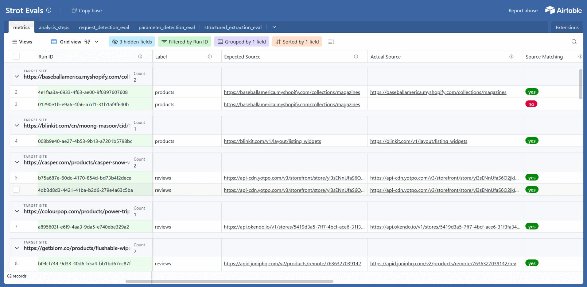

import NumberedList from '@site/src/components/NumberedList';
import BulletList from '@site/src/components/BulletList';
import TLDR from '@site/src/components/TLDR';
import TechnicalCard from '@site/src/components/TechnicalCard';
import DeepDive from '@site/src/components/DeepDive';
import ImageSlider from '@site/src/components/ImageSlider';
import SubSection from '@site/src/components/SubSection';

<TLDR>
LLM agentic systems fail in subtle ways. At Vertexcover Labs, we use a 5-part evaluation approach—powered by a structured logging foundation:

<NumberedList items={[
  "Custom reporting/observability app to inspect the step-by-step agent flow (screenshots, LLM traces, code samples, step context, JSON/text blocks, costs).",
  "Component/agent-level tests (like unit tests) to isolate/fix one step without re-running the whole agent.",
  "End-to-end evals that validate the final product output while also comparing each stage to explain failures.",
  "Eval reporting dashboard (Airtable or similar) showing run status with linked \"run → steps\" tables for fast triage.",
  "Easy promotion of failing production runs into test cases (just use the run_id)."
]} />

**Foundation:** a structured logging layer that makes all of the above trivial to build and maintain.
</TLDR>

{/* truncate */}

---

## Why Evals & Observability Are Hard for LLM/Agent Systems

Everyone agrees evals & obs are critical. Few teams have a practical pattern that works across domains. The pain points we kept hitting (and solved):

**🎲 LLMs are non-deterministic**  
Small prompt shifts, model updates, or temperature changes can flip outcomes. You need repeatable tests and live monitors per call.

**🔗 Deeply chained workflows**  
Planning → tool calls → retries → post-processing. A bad first decision can ripple invisibly. Only looking at the final result hides root causes, but product quality still depends on the final result.

**⏱️ Full-run latency & cost**  
Running agents end-to-end for every tweak is slow and expensive. We need component isolation and captured inputs to iterate quickly.

**🔍 Debugging requires rich context**  
Off-the-shelf APM doesn't understand domain-specific failures like "selected wrong data source", "missed edge case in extraction logic", or "hallucinated field mappings". We need pipeline-aware traces: visual state captures, complete LLM interactions, generated artifacts, execution paths, and granular cost attribution.

**📉 Evals decay as use cases evolve**  
Your perfect eval suite from Q1 becomes incomplete by Q3. New customer patterns emerge, edge cases multiply, and existing tests miss real-world failures. You need frictionless eval creation from production data—one command to turn today's failure into tomorrow's regression test, without manual test writing.

We see these issues across all our agentic projects. Below is how we solve them in general, using our OSS project Strot as a running example.

---

## Context: Strot (Example System)

[Strot](https://github.com/vertexcover-io/strot) reverse-engineers websites to discover internal APIs and extract structured data. The pipeline has three AI components:

| Component | What It Does | Example Failure |
|-----------|--------------|------------------|
| **Request Detection** | Identify the network call loading target data | Picks non-related network call |
| **Parameter Analysis** | Detect pagination and dynamic filters | Misses cursor param, breaks pagination |
| **Structured Extraction** | Generate Python to parse responses into schema | Wrong JSON key mapping |

Each can fail differently across thousands of site patterns.

---

## Our Solution (4+1 Stages)

### 1) Make Debugging Fast & Visual (Custom Next.js Reporting App)

<TechnicalCard type="implementation" title="Pipeline-Aware Debug UI">

**What we built:** A pipeline-aware debug UI that shows every step in a run:

<NumberedList items={[
  "Browser screenshots per step (so you see the exact DOM/context the LLM \"saw\")",
  "LLM prompt/response traces with token counts & costs",
  "Artifacts like generated code and validation results",
  "Run timeline + per-step cost/time + rollups"
]} />

**Why custom:** General APM lacks LLM context and domain objects like "network request candidates," "pagination keys," etc. Our UI renders code blocks, JSON blocks, and text blocks differently so you can scan fast.

**What it unlocks:**

<BulletList items={[
  "Diagnose in seconds (\"wrong request chosen\")",
  "Optimize budgets (\"this step is the cost hotspot\")",
  "No waiting for full pipeline completion—watch in flight"
]} />

</TechnicalCard>

import observabilityDashboard from "./observability-dashboard.gif";

<div style={{ margin: '20px 0' }}>
  
</div>

---

### 2) Component-Level Unit Testing (Agent "Lego Bricks")

Running the full agent to test a single change is slow and pricey. We treat each component as a unit:

<BulletList items={[
  "Provide captured inputs to just that component",
  "Support \"replay this step from an existing run\" (auto-plucks the right inputs via run_id)",
  "Validate outputs against expectations (pagination keys, dynamic filters, parse schema, etc.)"
]} />

This is akin to unit tests for agents: ship fixes in minutes, not hours.

**CLI example:**

```bash
echo '[{
  "request": {
    "url": "https://api.example.com/products",
    "queries": {"page": "2", "limit": "50"},
    "post_data": {"sort": "price", "filter": "new"}
  },
  "expected_pagination_keys": ["page", "limit"],
  "expected_dynamic_keys": ["sort", "filter"]
}]' | uv run stroteval
```



---

### 3) End-to-End Eval (Product-Level Confidence)

The product cares about the final output. Our E2E eval suite runs the full pipeline and checks:

<BulletList items={[
  "Correct source endpoint",
  "Pagination/dynamic keys",
  "Entity counts & schema parse correctness"
]} />

Crucially, we also compare intermediate stages so failures are explainable ("endpoint correct, pagination wrong").

**CLI example:**

```bash
echo '[{
  "job_id": "existing-job-uuid",
  "expected_source": "https://api.example.com/reviews",
  "expected_pagination_keys": ["cursor", "limit"],
  "expected_entity_count": 243
},
{
  "site_url": "https://example.com/category/abc",
  "query": "Listed products with name and prices",
  "expected_source": "https://api.example.com/products",
  "expected_pagination_keys": ["limit", "offset"],
  "expected_entity_count": 100
}]' | uv run stroteval
```

We run this suite on every deployment to catch system-level regressions before they reach users.

---

### 4) Airtable Dashboards (Explorable for the Whole Team)

We push eval results to two linked tables:

| Table | Contents | Purpose |
|-------|----------|----------|
| **Runs / Aggregates** | Pass rates by component/site/time; cost/time trends | High-level health monitoring |
| **Step Details** | One record per step with inputs, outputs, matches, screenshots, costs (linked to its run) | Deep debugging and analysis |



**Why Airtable?** Fast charts, human-friendly filtering, collab-ready, and it mirrors our step-by-step mental model.

---

### 5) Production Failures → New Tests (The Feedback Loop)

Any run that fails is already fully recorded via structured logs and run_id. Turning it into a test is trivial:

<NumberedList items={[
  "Grab run_id → auto-hydrate inputs for the failing component",
  "Save as a component test (today manual, automation is trivial from the same logs)",
  "The suite becomes a bug graveyard — nothing escapes twice"
]} />

---

## The Foundation: Structured Logging + Distributed Tracing

<DeepDive title="The Secret: Structured Logging Architecture">

Think of our logs like a database WAL: we can reconstruct everything from them.

**Minimal event schema (trimmed):**

```json
{
  "run_id": "uuid",
  "step_id": "uuid",
  "component": "request_detection | parameter_analysis | structured_extraction",
  "input": {...},
  "output": {...},
  "llm": {
    "model": "gpt-4.x",
    "prompt_tokens": 1234,
    "completion_tokens": 456,
    "cost_usd": 0.041
  },
  "artifacts": {
    "screenshots": ["s3://.../step1.png"],
    "code_file": "s3://.../parse.py"
  },
  "metrics": {
    "duration_ms": 1823,
    "success": true
  },
  "meta": {
    "site": "example.com",
    "job_id": "uuid",
    "prompt_version": "v17",
    "ts": "2025-09-02T10:12:03Z"
  }
}
```

**Why this matters:**

<BulletList items={[
  <><strong>Observability:</strong> powers the Next.js debug app in real time</>,
  <><strong>Evaluation:</strong> feeds component/E2E checks and Airtable rollups</>,
  <><strong>Reproducibility:</strong> replay any step; generate tests from prod failures</>,
  <><strong>Governance:</strong> PII-aware redaction; prompt & model versioning; deterministic reruns when needed</>
]} />

</DeepDive>

---

## Results (Across Strot & Similar Projects)

<TechnicalCard type="performance" title="Impact Metrics">

<NumberedList items={[
  "95% success across 50+ site architectures",
  "10× faster debugging via visual traces & step replays",
  "3× faster iteration thanks to component isolation",
  "Zero regressions once full coverage landed"
]} />

</TechnicalCard>

---

## Key Takeaways

Building effective observability and evaluation for agentic systems requires a holistic approach:

<NumberedList items={[
  <><strong>Structure logs once</strong> — Proper logging infrastructure is the foundation (observability, evals, and debugging)</>,
  <><strong>Make debugging visual</strong> — Custom app to inspect step-by-step agent flow (screenshots, LLM traces, code samples, step context, JSON/text blocks, costs)</>,
  <><strong>Test in layers</strong> — component-level tests for rapid iteration, E2E evals for product confidence</>,
  <><strong>Build reporting dashboards</strong> An easy way to view results of e2e evals with ability to drill down into each step</>,
  <><strong>Close the feedback loop</strong> — easy conversion of production failures into component and E2E regression tests</>,
  <><strong>Keep interfaces simple</strong> — CLI tools for running evals, web dashboards for exploring results</>
]} />

The framework transforms AI development from "hope it works" to "know it works."

---

🔗 **Code**: [github.com/vertexcover-io/strot](https://github.com/vertexcover-io/strot)  
📄 **Docs**: [Evaluation Guide](https://github.com/vertexcover-io/strot#-evaluation)  