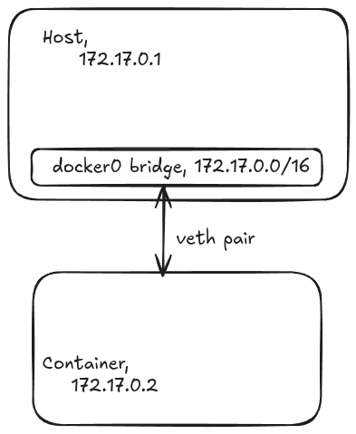
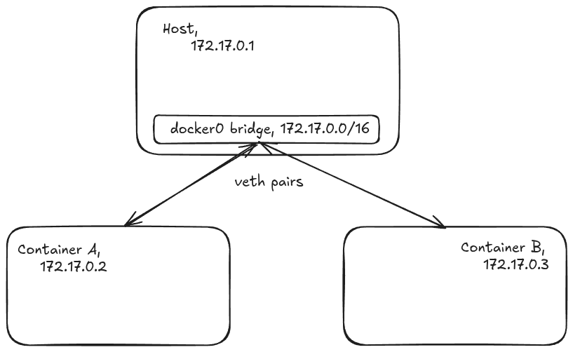

For those of the initiated, who are aware of how docker system works and just wish for a no nonsense, TLDR
benchmark results, here they are,

1) TCP Network bandwidth between a container and host system
    - When Container acts as server, and Host as client
        => 3.5-4 GBytes/sec
    - When Host acts as server, and Container as client
        => 3-3.5 GBytes/sec
2) TCP Network bandwidth between 2 containers running on same docker network
    => 3.7 GBytes/sec
3) Connection between 2 containers running on same networking, but with host acting as a proxy.
    - Userspace proxy, (`socat` utilized)
        => 0.6 GBytes/sec
    - Kernel space proxy (`iptables` routing set)
        => 2.8 GBytes/sec
        
For people that wish to know more about docker networking, or perhaps how the above experiment was conducted,
you can read on for more.

{/* truncate */}

## Docker Networking

Before going on to the explanation of what a docker network is, I would like to start off by explaining what exactly 
a docker networking is and how it works. If you have docker currently running on your system right now, I recommend you try
and run a command to show all the network interfaces in your system. For linux the command is `ip a` if you have `iproute2` utility
installed.

Now depending on the number of your physical network connections, and the number of docker containers you might see a lot of 
network interfaces listed, but in particular I would like you to focus on something that is named `docker0`. This is the 
default network created by docker on your system, and how it hooks up any container you run with `docker run` that you don't 
explicitly connect to a network.
```
8: docker0: <BROADCAST,MULTICAST,UP,LOWER_UP> mtu 1500 qdisc noqueue state UP group default
    link/ether 1e:18:c5:dd:7d:c7 brd ff:ff:ff:ff:ff:ff
    inet 172.17.0.1/16 brd 172.17.255.255 scope global docker0
       valid_lft forever preferred_lft forever
    inet6 fe80::1c18:c5ff:fedd:7dc7/64 scope link proto kernel_ll
       valid_lft forever preferred_lft forever
```

Similarly, depending on the number of containers you have running, you will see the same number of additional network interfaces,
that start with `veth` prefix,
```
9: veth68ef86c@if2: <BROADCAST,MULTICAST,UP,LOWER_UP> mtu 1500 qdisc noqueue master docker0 state UP group default
    link/ether 8e:fd:71:e2:df:b0 brd ff:ff:ff:ff:ff:ff link-netnsid 0
    inet6 fe80::8cfd:71ff:fee2:dfb0/64 scope link proto kernel_ll
       valid_lft forever preferred_lft forever
```
A point to note is on this particular `veth` interface you can see `master docker0`. What does this signify ?

To give further information, the `docker0` network interface highlighted above is what is known as a docker bridge network. To be more
specific it is a specific kind of virtual network interface, one of many in fact, that you can create in a linux system. This 
bridge network interface, allows other network interface to be "connected" virtually. This is analogous to a physical network switch.
A network switch only connects devices to the same LAN. It has no routing capability, and in fact it is required that all the devices
that are connected on the network be on the same CIDR network range. Any new docker network you create will always result in creation
of a new bridge network interface, and every container that is on the same docker network will have a connection to that specific
network bridge.

This `veth` network interface is also another virtual Network interface provided for us by Linux, that allows 
us to connect any 2 isolated network systems within the same running linux system. So for now, you can understand that all the 
containers running on the system will have at least 1 `veth` interface. The `veth` interface is always connected to a bridge network,
to allow container access to that docker network. This can be seen by the word `master docker0` which means, that this `veth` is 
connected to default `docker0` network bridge.

## What happens when a container is created without connecting to network?

Imagine you run a `docker run --rm -it ubuntu:latest` command to create a ubuntu container and run it. Since a network was not
specified, the container by default will be added to the default docker network `docker0`. Now, once the container has been created,
a `veth` pair of interfaces are created, one of which is inside container network space, and the other in the host network space. 
The `veth` on the host network space is then connected to the default `docker0` bridge network. Each of the bridge network has a 
range of IP that can be assigned, which is visible by looking at the result of `ip a`. In case of my system, my `docker0` has a 
CIDR range of 172.17.0.1/16. Essentially, it means `172.17.0.0 - 172.17.255.255` IP range is available for any systems getting
connected to the device. The host itself is identifiable by `172.17.0.1` on this network. The container is assigned any IP that 
is currently available for on the system, which in my case was `172.17.0.2`. 



One caveat of this feature is that, you are actually able to reach any services, that the container uses using just the IP itself. 
You don't necessarily have to expose the port to utilize the service from the host. However, you will still have to bind the port, 
to expose the service to outside world. As without being bound, only the host and any other container on the same network will be 
able to access the service. Using a port bind, will expose the service on any address "0.0.0.0". Which means depending on your
network configuration even external systems will be able to connect to the service.

## Test setup

For the test setup, I ran 2 different ubuntu containers on the same default docker network. The details for each system under test are
as follows,
- Host System
    => IP: 172.17.0.1
- Container A (ubuntu):
    => IP: 172.17.0.2
- Container B (ubuntu):
    => IP: 172.17.0.3
    


## iperf3

[`iperf3`](https://iperf.fr/) is a tool for active measurements of the maximum achievable bandwidth on IP networks. It allows for tuning of various,
parameters related to timing, buffers and protocols (TCP, UDP, SCTP with IPv4 and IPv6). For the purpose of the experiment, a TCP 
network was utilized, with default options.

## Execution

The test itself was quite simple to execute. `iperf3` was installed on each of the 3 system under test. For the first 2 tests, one can
simply, run the `iperf3 -s` to run it as server on a system, then connect from another system with `iperf3 -c <host>`. Since all the 
system are on the same network range, and are all connected by `docker0` bridge, each of them are able to reach another system with 
just the IP easily. 
However, for experiment number 3, we want the host to act as a proxy for network traffic, between the 2 systems. Technically, there are
2 ways one can do this,
- First is by using a userspace proxy. This is also what most people generally use to expose services to outside world. They have
a service running inside docker, then they utilize some kind of web proxy like nginx to expose the service to outside world. 
For the experiment, `socat` was utilized instead. `socat` is a utility that allows us to create two bidirectional byte streams, and 
transfers data between them. To establish, a proxy stream was quite simple, 
```
socat TCP4-LISTEN:5201,fork TCP4:172.17.0.3:5201 
```
What this is essentially doing is creating a TCP stream on port 5201, on the host system, which is connected to TCP on endpoint,
`172.17.0.3:5201`. With this container A, can reach a server at container B, by just sending the request to host instead.

- The second way to achieve this is by performing routing on the kernel space itself. This is in fact the same way any network router, 
that runs linux would work. For this feature to work, you first have to enable IP packets forwarding on your kernel. Without this 
feature enabled, any packet that reaches your linux machine will be dropped. With the feature enabled, the linux machine will
first evaluate it's internal routing table, and any routes matched will be forwarded appropriately else, discarded. A thing to note is
that this entire thing happens inside the kernel space, without the network reaching userspace at all. To check if the feature is
enabled, run `cat /proc/sys/net/ipv4/ip_forward`. If the output is 1, then it is enabled, if not then this feature is currently disabled.
You can enable it temporarily with, `sudo sysctl -w net.ipv4.ip_forward=1`. Generally a system that has docker installed should, have
this feature also enabled, as docker makes use of IP-forwarding quite extensively. 

>Note: This only enabled ip forwarding for IPv4 network, for IPv6 network you will have to use, `net.ipv6.conf.all.forwarding` key instead.

Once, forwarding has been enabled, you will also have to add the routes to the routes table for kernel to forward the routes. 
Let's assume that Container B will have the server and Container A is to proxy it's request through host, then use the following 
2 commands to setup the routing route.
```
sudo iptables -t nat -A PREROUTING -d 172.17.0.1 -p tcp --dport 5201 -j DNAT --to-destination 172.17.0.3:5201
sudo iptables -t nat -A POSTROUTING -s 172.17.0.0/16 -d 172.17.0.3 -j MASQUERADE
```

Let's understand what these 2 commands are doing, the first, command essentially means, that any tcp request that comes for 
ip `172.17.0.1` with destination port set to `5201` should be instead be forwarded to destination `172.17.0.3:5201`. 
Similarly, the second command, tells any request that will leave the system, with that fall into source IP of `172.17.0.0/16`, 
heading into `172.17.0.3` should have their network address masqueraded. Masquerading basically changes the source IP of the packet,
to the packet of the linux machine. This is a crucial step, as without masquerading, the response sent by server will not come 
back to the same host system. In our case, this doesn't really break network connection as our Container B can still reach, Container A 
however, in majority of cases, the secondary machine will not have the knowledge on how to route back the message, and thus the
network connection will be broken. Even so, failing to set this rule, will mean we have an incomplete experiment as the trip back,
is not passing through host and we explicitly wish to know the network bandwidth when request is passing through the host. 

## Evaluation of the results

For  the first experiment, we can observe that the network bandwidth actually differs by quite a bit, depending on,
which system is connecting to which system. This difference is actually something that I would have to investigate deeper, as I 
have no reasonable explanation for this difference. 

For the second experiment, we note that it doesn't matter which container acts as server and which as client. Since, both
are on the same bridge network, the network simply is passed along the bridge network and thus each of them have the same bandwidth. 
Also the bandwidth is on the higher side. 

For the third experiment, with introduction of userspace proxy, we see the bandwidth tanks quite a bit. One possible explanation is,
that the network packet has to pass through the entire linux network stack twice, as when the packet reaches userspace the entire, 
the entire chain has already completed. Again sending out a packet means start of a new chain. Similarly, for the kernel routing option,
we still see a decrease in bandwidth, but not as significant as it happened in userspace. Here the network packet is inspected 
and modified as it's traversing the network chain so only a single pass needs to happen but still, passing through inspection
and additional network passes probably resulted in lesser bandwidth. 

For any one wishing to replicate experiment, posting back your result would be quite helpful. The numbers that were generated,
have all been tested on a single device. Even if you get different numbers it would still be interesting to know if the relative 
difference between each of these systems still hold or not. 


